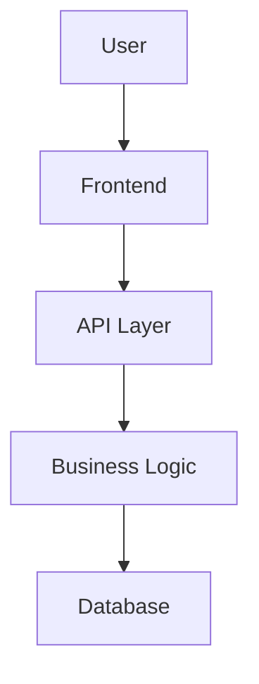

# Architecture

**Last Updated:** YYYY-MM-DD

---

## Overview

[One paragraph system description. What does this system do? What problems does it solve?]

Example:
> This project is a [type] system that [primary function]. It uses [key technology] to [main benefit] for [target users].

---

## System Diagram



Or ASCII art:
```
┌─────────┐     ┌─────────────┐     ┌──────────┐
│  User   │────▶│  Frontend   │────▶│   API    │
└─────────┘     └─────────────┘     └──────────┘
                                          │
                                          ▼
                                    ┌──────────┐
                                    │ Database │
                                    └──────────┘
```

---

## Core Components

### Component 1: [Name]

- **Purpose**: [One sentence about what this component does]
- **Technology**: [Framework/library/language]
- **Location**: `path/to/component`
- **Key Files**: `main.js`, `config.js`, `utils.js`
- **Dependencies**: Component 2, External Library X

**Responsibilities**:
- Responsibility 1
- Responsibility 2

### Component 2: [Name]

- **Purpose**: [One sentence]
- **Technology**: [Framework/library]
- **Location**: `path/to/component`
- **Key Files**: `handler.js`, `validator.js`
- **Dependencies**: None

**Responsibilities**:
- Responsibility 1
- Responsibility 2

### Component 3: [Name]

[Continue pattern for each major component]

---

## Data Flow

### Request Flow

1. **User Action** → User triggers action via UI
2. **Frontend Processing** → Validates input, prepares request
3. **API Call** → Sends request to backend API
4. **Business Logic** → Processes request, applies rules
5. **Database Query** → Retrieves or stores data
6. **Response** → Returns result through layers back to user

### Example: User Authentication Flow

```
User Login Request
  ↓
Frontend validates credentials format
  ↓
API endpoint receives POST /auth/login
  ↓
Auth middleware checks rate limits
  ↓
Business logic verifies credentials
  ↓
Database query fetches user record
  ↓
JWT token generated
  ↓
Response with token sent to frontend
  ↓
Frontend stores token in secure storage
```

---

## Key Technologies

| Technology | Purpose | Version |
|------------|---------|---------|
| Node.js | Runtime | 18.x |
| Express | Web framework | 4.x |
| PostgreSQL | Database | 14.x |
| React | Frontend | 18.x |

---

## Key Decisions

See [ADR/](./ADR/) directory for detailed Architectural Decision Records.

**Major Decisions**:
- [ADR-001](./ADR/001-database-choice.md) - Use PostgreSQL for primary database
- [ADR-002](./ADR/002-authentication-strategy.md) - JWT-based authentication
- [ADR-003](./ADR/003-api-design.md) - RESTful API design

---

## Security

### Authentication
- JWT tokens with 1-hour expiration
- Refresh token rotation for extended sessions
- bcrypt for password hashing (cost factor 12)

### Authorization
- Role-based access control (RBAC)
- Three roles: Admin, User, Guest
- Permissions enforced at API layer

### Data Protection
- All API calls over HTTPS
- Environment variables for secrets
- Database credentials never in code
- Regular security audits

---

## Deployment

### Architecture Diagram

```
┌─────────────────┐
│   Load Balancer │
└────────┬────────┘
         │
    ┌────┴────┐
    │         │
┌───▼──┐  ┌──▼───┐
│ App  │  │ App  │  (Multiple instances)
│ Node │  │ Node │
└───┬──┘  └──┬───┘
    │         │
    └────┬────┘
         │
    ┌────▼────┐
    │ Database│
    └─────────┘
```

### Environment Stages
- **Development**: Local development environment
- **Staging**: Pre-production testing environment
- **Production**: Live production environment

### Scaling Strategy
- Horizontal scaling: Add more app instances
- Database: Read replicas for scaling reads
- Caching: Redis for frequently accessed data

---

## Performance Considerations

- **Database Indexing**: All foreign keys and commonly queried fields indexed
- **Caching**: 15-minute cache for static content
- **Lazy Loading**: Large datasets loaded on demand
- **Connection Pooling**: Max 10 database connections per app instance

---

## Monitoring & Observability

- **Logging**: Structured JSON logs to stdout
- **Metrics**: Request count, latency, error rate
- **Health Checks**: `/health` endpoint for liveness/readiness
- **Alerts**: Error rate > 5%, response time > 500ms

---

## Development Workflow

1. Clone repository
2. Install dependencies (`npm install`)
3. Copy `.env.example` to `.env`
4. Run migrations (`npm run migrate`)
5. Start dev server (`npm run dev`)

### Testing Strategy

- **Unit Tests**: Jest for component testing
- **Integration Tests**: Supertest for API testing
- **E2E Tests**: Playwright for full workflow testing

---

## Future Enhancements

- [ ] GraphQL API layer
- [ ] Real-time updates via WebSockets
- [ ] Microservices architecture for scaling
- [ ] Machine learning for personalization

---

## References

- [System Requirements Document](./REQUIREMENTS.md)
- [API Documentation](./API.md)
- [Database Schema](./DATABASE.md)
- [Deployment Guide](./DEPLOYMENT.md)

---

**Document Version**: 1.0  
**Last Reviewed**: YYYY-MM-DD  
**Next Review**: YYYY-MM-DD
